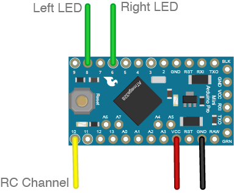

# Paramotor LED Driver Firmware

This is a simple LED driver for an RC Paramotor that comes with 7 modes which can be switched using 2x 3 position switches (ex Taranis X7).

## Demo

## Get Started

What you need:

- Arduino Pro Mini or similar like a Trinket
- Radio with 2x 3 position switches (EX Taranis X7)

For the purpose of illustration I will be using a Taranis X7 for setup and I assume you know how to handle an Arduino. This is using the default settings of the code and you may adjust it:

1) Upload the code to your Arduino.

2) Connect the RC Channel and LED data channels. The board is powered directly from your RC receiver. I connected the RC VCC and GND as well the LED's VCC and GND to the Arduino's power pin.

WARNING: Do not connect your board to your programmer and your RC receiver at the same time. Disconnect the board from your RC receiver while programming. You have been warned.

3) Setup your radio mixing:

I have included my [radio settings](docs/opentx_settings.pdf) in this repo but in general you have to setup the mix between two 3 position switches:

I have my mix on CH4 using the two top right 3 position switches.

4) Turn everything on and test it out.

## Available Modes

Mode 			|	Purpose
---------------------------------------------------------------------------------
Boot			|	Red blinking lights, if there is no RC signal
Navigation		|	Red/Green position lights and white strobe
Landing 		|	Red/Green position lights, large blue flashing lights
Minimal  		|   Red/Green position lights only on the tips
Police  		| 	Red/Blue flashing police lights (Cop in the sky)
Disco  			|   Disco mode
Blue  			|   Bottom red/green position lights, Top blue and white
Off  			|   All LED's off

## License

MIT

